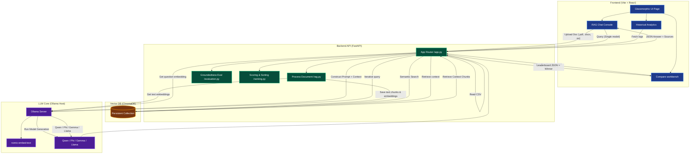

# Multimodal RAG Analytics & Benchmarking System

A state-of-the-art Web Application designed to upload documents, build a local vector database, chat using RAG (Retrieval-Augmented Generation), and compare/benchmark the performance of multiple local Large Language Models (LLMs) side-by-side.

---

## 🏗️ Project Architecture



---

## 📖 RAG Pipeline & Core Approach

The system implements a local **Retrieval-Augmented Generation (RAG)** architecture using local embeddings, persistent vector indexing, and prefix-routed LLM generation.

### 1. Document Parsing & Text Extraction
*   **Approach**: Extension-based parsing triggers specific file readers:
    *   `.pdf` $\rightarrow$ Extracted using `pypdf.PdfReader` to extract textual layers across all pages.
    *   `.docx` $\rightarrow$ Extracted using `docx.Document` to loop through all body paragraphs.
    *   `.txt` $\rightarrow$ Parsed using standard Python `open()` text streams with `utf-8` encoding.
*   **Fail-safety**: If any document fails to parse, it returns an empty string, preventing server crashes.

### 2. Text Chunking
*   **Approach**: The extracted raw text is split into uniform segments using a character-count sliding window.
*   **Parameters**: **500 character chunks** (`size=500` in `rag.py`) are compiled:
    $$\text{Text} \rightarrow [\text{chunk}_1(0\text{-}500), \text{chunk}_2(500\text{-}1000), \ldots]$$
*   **Benefits**: Keeps vector context cohesive and fits standard local embedding context limits.

### 3. Text Embedding & Vector Storage
*   **Model**: **`nomic-embed-text:latest`** (768-dimensional dense vector model served via Ollama).
*   **Embedding Pipeline**:
    *   For each text chunk $c$, the API queries `http://localhost:11434/api/embed` to get vector $\mathbf{v}_c$.
    *   Each chunk is registered in **ChromaDB** with a unique identifier: `str(chunk_index) + file_path`.
*   **Vector DB**: Saved to disk locally under `/vector_db` via `chromadb.PersistentClient`.

### 4. Semantic Retrieval & Querying
*   **Approach**: Similarity retrieval using cosine/vector distance.
*   **Process**:
    1.  User enters a question $q$.
    2.  The question is embedded using the same `nomic-embed-text:latest` model to get query vector $\mathbf{v}_q$.
    3.  A semantic search query is run on the ChromaDB collection:
        $$\text{ChromaDB Query}(\mathbf{v}_q) \rightarrow \text{Top 3 closest text chunks} \ (n=3)$$
    4.  The top 3 chunks are concatenated using newlines to formulate the text context.

### 5. Prompt Engineering & Grounded Generation
*   **Prompt Template**:
    ```text
    You are an AI Assistant.
    Answer ONLY using the context.
    If unavailable say "I don't know based on the document."
    
    Context:
    {retrieved_chunks}
    
    Question:
    {user_question}
    ```
*   **Generation Models**:
    *   **Local LLMs** (routed to Ollama `/api/generate`):
        *   `qwen3:latest` (8.2B parameter Q4 quantization)
        *   `phi:latest` (3B parameter Q4 quantization)
        *   `gemma:2b` (3B parameter Q4 quantization)
        *   `llama3.2:1b` (1.2B parameter Q8 quantization)
    *   **Cloud LLMs** (routed to external APIs if keys are active in `.env`):
        *   Gemini: `gemini-2.5-flash` / `gemini-1.5-pro`
        *   Groq: `llama-3.3-70b-versatile` / `mixtral-8x7b-32768`
        *   DeepSeek: `deepseek-chat`
        *   OpenRouter: `meta-llama/llama-3.3-70b-instruct` / `google/gemini-2.5-flash`

---

## 🛠️ Technology Stack

*   **Frontend**: React (v19), Vite (v8), Chart.js (v4) & React-Chartjs-2, Axios, and high-end modern **Vanilla CSS** (built using dark mode glassmorphic guidelines, Outfit & Plus Jakarta Sans typography, and custom micro-animations).
*   **Backend**: FastAPI, Uvicorn, Pandas, Requests, Pydantic.
*   **Vector Database**: ChromaDB (configured with persistent local storage at `vector_db/`).
*   **Document Parsers**: PyPDF (for `.pdf` files) and Python-docx (for `.docx` files).
*   **Local LLM Engine**: Ollama (serving embeddings and generation models on `http://localhost:11434`).

---

## 🚀 Getting Started

### 1. Prerequisite: Setup Ollama
Make sure Ollama is installed on your local machine and running.
Verify you have the required models downloaded:
```bash
# Pull embedding model used for RAG
ollama pull nomic-embed-text

# Pull LLMs used for comparison
ollama pull qwen3:latest
ollama pull phi:latest
ollama pull gemma:2b
ollama pull llama3.2:1b
```

### 2. Configure Backend Server
Create a `.env` file in the `backend/` directory specifying your API keys:
```env
GEMINI_KEYS=your_gemini_api_key
GROQ_KEYS=your_groq_api_key
DEEPSEEK_KEYS=your_deepseek_api_key
OPENROUTER_KEYS=your_openrouter_api_key
```

Navigate to the `backend/` directory, activate your virtual environment, and install dependencies:
```bash
# Navigate to backend
cd backend

# Activate Conda environment
conda activate iit_internship

# Install dependencies
pip install -r requirements.txt

# Start backend server
uvicorn app:app --reload --host 127.0.0.1 --port 8000
```

### 3. Launch Frontend Application
Open another terminal, navigate to the `frontend/` directory, and start the development server:
```bash
# Navigate to frontend
cd frontend

# Install package dependencies
npm install

# Start Vite dev server
npm run dev
```
Open your browser and navigate to the address shown in the terminal (typically `http://localhost:5173`).

---

## 📊 LLM Evaluation & Ranking Formula

The system uses a unified **Multi-Criteria Evaluation Score** to score and rank models between **0 and 100**.

### Unified Evaluation Score (0 - 100)
Calculated via `calculate_score(item)` inside [ranking.py](file:///f:/internship/IITG/RAG_Chatbot/backend/ranking.py) when models are compared or sorted on the leaderboard. It grades responses based on four weighted pillars:

$$\text{Evaluation Score} = (\text{Retrieval} \times 40) + (\text{Groundedness} \times 30) + \left(\frac{10}{\text{Latency} + 1}\right) \times 20 + \min\left(\frac{\text{Words}}{100}, 1\right) \times 10$$

*   **Retrieval Relevance (40% Weight - Max 40 pts)**: Grade indicating structural matching against vector indexes. Defaulted to `1.0`.
*   **Groundedness Score (30% Weight - Max 30 pts)**: Measures how well the model response sticks to the document. Calculated using word overlap between response and context chunks:
    $$\text{Groundedness} = \frac{\text{Overlap Words}}{\text{Total Answer Words}}$$
*   **Response Speed / Latency (20% Weight - Max 20 pts)**: Rewards fast response models using a decaying curve. If a request fails, latency is set to $\ge 99.99$ and the score defaults to $0.0$.
    $$\text{Latency Factor} = \frac{10}{\text{Latency (seconds)} + 1}$$
*   **Word Count / Verbosity (10% Weight - Max 10 pts)**: Rewards detailed responses up to 100 words:
    $$\text{Verbosity Factor} = \min\left(\frac{\text{Words}}{100}, 1\right)$$

---

## 🔌 API Reference

### 1. Base Healthcheck
*   **Endpoint**: `GET /`
*   **Description**: Verifies if the backend API is active.
*   **Response**: `{"status": "success", "message": "Backend Running"}`

### 2. Get Available Models
*   **Endpoint**: `GET /models`
*   **Description**: Queries the local Ollama instance for installed tags.
*   **Response**: List of available model tags.

### 3. Get Historical Analytics
*   **Endpoint**: `GET /analytics`
*   **Description**: Reads all historical runs recorded in the local CSV log and formats them for the dashboard.
*   **Response**: List of previous benchmark runs.

### 4. Upload & Index Document
*   **Endpoint**: `POST /upload`
*   **Description**: Accepts a file (`file: UploadFile`) and indexes its text chunks using ChromaDB + Ollama.

### 5. Chat with RAG
*   **Endpoint**: `POST /chat`
*   **Description**: Queries ChromaDB for context based on a question and answers using the selected model.

### 6. Benchmark Models
*   **Endpoint**: `POST /compare`
*   **Description**: Tests a question against all active LLMs, scores their outputs (speed, groundedness, word length), and returns a ranked leaderboard with a declared winner.

---

## 📚 Feature Deep-Dives

For detailed explanations, mathematical formulations, and step-by-step process walkthroughs of individual system features, refer to the documentation files:

1. 📄 **[PDF Input Ingestion Pipeline](file:///f:/internship/IITG/RAG_Chatbot/docs/pdf_input.md)**: Details structural text extraction, whitespace sanitization, and fallback loops.
2. 🎵 **[Audio Input Ingestion Pipeline](file:///f:/internship/IITG/RAG_Chatbot/docs/audio_input.md)**: Explains Mel-spectrogram processing and Whisper speech-to-text decoding.
3. 🎥 **[Video Input Ingestion Pipeline](file:///f:/internship/IITG/RAG_Chatbot/docs/video_input.md)**: Explains MoviePy audio soundtrack extraction, temporary Wav compilation, and Whisper indexing.
4. ⚙️ **[RAG Retrieval Pipeline](file:///f:/internship/IITG/RAG_Chatbot/docs/rag_pipeline.md)**: Explains text chunking equations, local dense vector embeddings, dynamic ChromaDB dimensions separation, and Cosine similarity.
5. 🏆 **[LLM Ranking & Evaluation Score](file:///f:/internship/IITG/RAG_Chatbot/docs/ranking_evaluation.md)**: Details the Multi-Criteria LLM score formula, word overlap groundedness ratio, speed decaying curve, and Singular Value Decomposition (SVD) vector projection algorithms.

